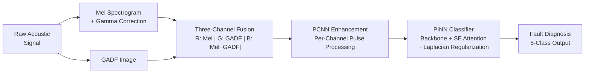
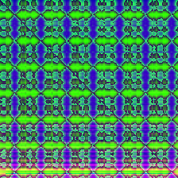
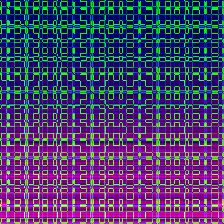
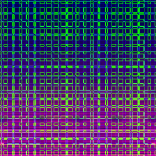
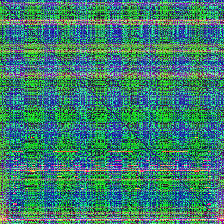
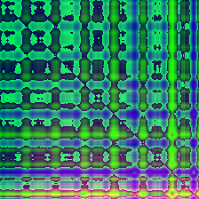
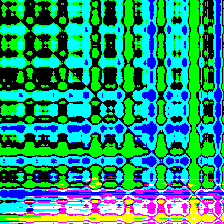
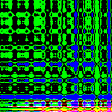
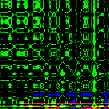
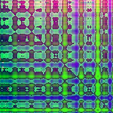

# PCNN-Enhanced Multi-Representation Fusion with Physics-Informed Learning for Power Transformer Fault Diagnosis

[](https://www.python.org/)
[](https://pytorch.org/)
[](https://developer.nvidia.com/cuda-toolkit)
[]()

A reproducible deep learning research framework for **power transformer acoustic fault diagnosis**. The method fuses **Mel spectrograms** and **Gramian Angular Difference Fields (GADF)** into three-channel representations, enhances them through **Pulse-Coupled Neural Networks (PCNN)** for noise suppression, and classifies faults using **Physics-Informed Neural Networks (PINN)** with Laplacian smoothness regularization derived from the acoustic Helmholtz equation.

> **Manuscript:** *PCNN-Enhanced Multi-Representation Fusion with Physics-Informed Learning for Power Transformer Fault Diagnosis* — under review at `Journal of Failure Analysis and Prevention`.


## Overview



### Three Core Innovations

| # | Innovation | Description | Mechanism |
|---|-----------|-------------|-----------|
| 1 | **Mel-GADF Fusion** | Three-channel RGB representation combining spectral energy, temporal correlation, and cross-modal difference | Captures complementary fault signatures missed by single modalities |
| 2 | **PCNN Enhancement** | Biologically-inspired pulse-coupled neural network with synchronized neuronal firing | Suppresses background noise while preserving coherent fault-induced structures |
| 3 | **Physics-Informed Learning** | Laplacian regularization derived from acoustic Helmholtz equation ($\nabla^2 p \approx 0$) | Enforces physically smooth feature representations; improves generalization on limited data |


## Key Experimental Results

All results are reported as **mean $\pm$ std** over 5-fold stratified cross-validation with session-aware data partitioning on a real-world 220 kV transformer dataset (5 conditions, 661 segments).

### Ablation Study — Component Contributions

| Model Variant | Accuracy (%) | $F_1^w$ | $G_{\text{mean}}$ | $\sigma_{F_1}$ |
|--------------|:----------:|:-------:|:---------:|:------:|
| (1) Baseline AlexNet | 92.93 $\pm$ 1.24 | 0.9281 | 0.9264 | 0.0318 |
| (2) + SE Attention | 94.75 $\pm$ 1.08 | 0.9463 | 0.9491 | 0.0264 |
| (3) + SE + PINN | 95.73 $\pm$ 0.95 | 0.9561 | 0.9612 | 0.0215 |
| (4) + SE + PCNN | 96.20 $\pm$ 0.88 | 0.9608 | 0.9656 | 0.0192 |
| **(5) Full (SE + PCNN + PINN)** | **97.26 $\pm$ 0.82** | **0.9715** | **0.9875** | **0.0133** |

> Each component contributes measurably: SE (+1.82%), PCNN (+1.53%), PINN (+1.06%). Full model reduces $\sigma_{F_1}$ by **58%** vs. baseline.

### Backbone Architecture Comparison

| Backbone | Accuracy (%) | $F_1^w$ | $G_{\text{mean}}$ | $\sigma_{F_1}$ |
|----------|:----------:|:-------:|:---------:|:------:|
| PINN + LeNet | 72.24 | 0.6718 | 0.5635 | 0.3226 |
| PINN + ResNet-18 | 95.45 | 0.9548 | 0.9711 | 0.0391 |
| PINN + ConvNeXt-T | 95.45 | 0.9536 | 0.9593 | 0.0428 |
| **PINN + AlexNet-SE** | **96.48** | **0.9649** | **0.9707** | **0.0133** |

### GASF vs. GADF Feature Comparison

| Feature | PCNN | Accuracy (%) | $F_1^w$ | $G_{\text{mean}}$ | $\sigma_{F_1}$ |
|---------|:----:|:----------:|:-------:|:---------:|:------:|
| Mel-GADF | — | 93.94 | 0.9392 | 0.9587 | 0.0434 |
| Mel-GASF | — | 92.42 | 0.9132 | 0.8503 | 0.1490 |
| Mel-GADF | ✓ | 96.97 | 0.9684 | 0.9510 | 0.0485 |
| Mel-GASF | ✓ | 96.97 | 0.9693 | 0.9736 | 0.0280 |

> GADF outperforms GASF due to difference-based encoding ($\sin(\phi_i - \phi_j)$), which captures transient fault phase deviations more sensitively.

### Comparison with State-of-the-Art

| Method | Accuracy (%) | $F_1^w$ | $G_{\text{mean}}$ |
|--------|:----------:|:-------:|:---------:|
| SVM + PCA (Handcrafted) | 82.57 $\pm$ 2.14 | 0.8214 | 0.7938 |
| 1D-CNN (End-to-End, Raw) | 87.14 $\pm$ 1.86 | 0.8692 | 0.8517 |
| EfficientNet-B0 (2D) | 93.68 $\pm$ 1.12 | 0.9351 | 0.9423 |
| ViT-B/16 (2D) | 94.11 $\pm$ 1.08 | 0.9398 | 0.9482 |
| ConvNeXt-T (2D) | 94.92 $\pm$ 1.02 | 0.9476 | 0.9564 |
| Swin-T (2D) | 95.82 $\pm$ 0.94 | 0.9568 | 0.9689 |
| **Proposed (Ours)** | **97.26 $\pm$ 0.82** | **0.9715** | **0.9875** |

> The proposed method outperforms Swin Transformer by **+1.44%** ($p = 0.003$, paired $t$-test), demonstrating that PCNN + PINN provides benefits beyond architectural innovation alone.


## Visual Examples

### Multi-Condition Fused Representations

The three-channel fused images for five transformer operating conditions. Each column shows a different fault type; the RGB channels encode Mel spectrogram (R), GADF (G), and their pixel-wise difference (B).

<p align="center">
  <em>Mel-GADF fused representations across five conditions (proposed method)</em>
</p>

| Normal (N0) | Harmonic (N1) | DC-Bias (N2) | Looseness (N3) | Partial Discharge (N4) |
|:-----------:|:-------------:|:------------:|:--------------:|:----------------------:|
|  |  |  |  |  |

### PCNN Enhancement Effect

Increasing the PCNN initial threshold $V_T$ progressively suppresses background noise while preserving fault-induced structural features. Optimal balance is achieved at $V_T = 0.8$.

| Original | $V_T = 0.4$ | $V_T = 0.6$ | $V_T = 0.8$ |
|:--------:|:-----------:|:-----------:|:-----------:|
|  |  |  |  |

### Gamma Correction

Gamma correction ($\gamma = 1.7$) enhances low-energy spectral regions, revealing subtle fault-related features.

| Before ($\gamma = 1.0$) | After ($\gamma = 1.7$) |
|:------------------------:|:-----------------------:|
|  |  |

## Project Structure

```
PINN/
├── README.md                         # This file
├── requirements.txt                  # Python dependencies
├── run_pipeline.sh                   # One-click full pipeline script
├── research-log.md                   # Research notes and changelog
│
├── configs/
│   ├── default.yaml                  # Default training configuration
│   └── ablation.yaml                 # Ablation study configuration
│
├── raw-data/                         # Original .wav audio recordings
│   ├── Normal/          (185 files)  #   Normal operation
│   ├── Harmonic/        (109 files)  #   Harmonic distortion
│   ├── DCBias/          (119 files)  #   DC-bias magnetization
│   ├── Loosen/          (119 files)  #   Mechanical looseness
│   └── PartialDischarge/(119 files)  #   Partial discharge
│
├── datasets/                         # Processed image datasets (generated)
│   └── mel_gadf_pcnn/                #   train/val/test splits after PCNN
│
├── experiments/                      # Experiment outputs (generated)
│   ├── exp1/                         #   Single experiment run
│   └── ablation/                     #   Ablation study results
│
├── scripts/                          # Executable experiment scripts
│   ├── build_dataset.py              #   WAV → Mel-GADF fused images + split
│   ├── apply_pcnn.py                 #   PCNN enhancement of fused images
│   ├── train.py                      #   Train any PINN backbone via config
│   ├── evaluate.py                   #   Evaluate trained model (metrics+plots)
│   ├── visualize.py                  #   Training curves + comparison charts
│   ├── run_experiments.py            #   Batch experiment runner
│   ├── ablation_study.py             #   Component-wise ablation (Table 6)
│   ├── sota_comparison.py            #   SOTA benchmarking (Table 7)
│   ├── hyperparam_sensitivity.py     #   Hyperparameter sensitivity analysis
│   └── noise_robustness.py           #   Noise robustness evaluation
│
├── src/                              # Core library
│   ├── datasets/
│   │   └── image_classification.py   #   DataLoader builder + Dataset class
│   ├── models/
│   │   ├── pcnn.py                   #   PCNN layer (pulse-coupled dynamics)
│   │   ├── se_block.py               #   SE channel attention module
│   │   ├── pinn_alexnet.py           #   AlexNet-SE + physics head + feedback
│   │   ├── pinn_resnet.py            #   ResNet-18 + physics head + feedback
│   │   ├── pinn_lenet.py             #   LeNet-5 + physics head
│   │   ├── pinn_vggnet.py            #   VGG16-BN + physics head + feedback
│   │   └── pinn_convnext.py          #   ConvNeXt-Tiny + physics head
│   ├── trainers/
│   │   └── workflow.py               #   Training orchestration (train/eval/log)
│   └── utils/
│       ├── config.py                 #   YAML config loading/merging
│       ├── metrics.py                #   Classification metrics + ROC-AUC
│       ├── laplacian.py              #   Physics loss (Laplacian regularization)
│       ├── train_eval.py             #   Training & evaluation loops
│       ├── experiment.py             #   Seed setting + device resolution
│       ├── plot_confusion.py         #   Confusion matrix plotting
│       └── tsne.py                   #   t-SNE feature visualization
│
├── data-optimization/                # Preprocessing utilities
│   ├── __init__.py                   #   Gamma correction, Mel, GAF generation
│   └── noise_robustness.py           #   AWGN & salt-pepper noise injection
│
└── paper/                            # Manuscript and LaTeX source
    ├── manuscript.tex
    ├── references.bib
    ├── drawing/                      #   Architecture diagrams (draw.io)
    ├── confusion/                    #   Confusion matrix PDFs
    ├── curve/                        #   Training curve PDFs
    └── figures/                      #   Paper figures
```


## Quick Start

### Prerequisites

- **Python** 3.10+
- **CUDA** 12.8 (GPU recommended)
- **GPU** NVIDIA RTX 5090 or compatible (32 GB VRAM)

### Installation

```bash
git clone <repo-url> && cd PINN
pip install -r requirements.txt
```

### One-Command Pipeline

```bash
# Full automated pipeline: raw WAV → training
bash run_pipeline.sh

# Quick test (5 epochs)
bash run_pipeline.sh --quick

# Data preparation only (no training)
bash run_pipeline.sh --skip-train
```

### Manual Training

```bash
# Train with default AlexNet-SE + PCNN + PINN
python scripts/train.py --config configs/default.yaml

# Train ResNet-18 with custom settings
python scripts/train.py \
    --config configs/default.yaml \
    model.name=resnet \
    model.in_channels=3 \
    dataset.root_dir=./datasets/mel_gadf_pcnn \
    output.root_dir=./experiments/exp_resnet
```


## Dataset Construction

### Raw Data

The dataset comprises 651 acoustic segments (44.1 kHz, 16-bit, 1-second clips) from an operational 220 kV substation transformer:

| Condition | Label | Segments | Description |
|-----------|:-----:|:--------:|-------------|
| Normal | N0 | 185 | Healthy operation |
| Harmonic Distortion | N1 | 109 | Short-circuit impact |
| DC-Bias | N2 | 119 | DC magnetization |
| Mechanical Looseness | N3 | 119 | Loose components |
| Partial Discharge | N4 | 119 | Insulation defect |

### Building the Dataset

**Option A — Automated pipeline (recommended):**
```bash
bash run_pipeline.sh --skip-train
```

**Option B — Step by step:**
```bash
# 1. Build Mel-GADF fused images
python scripts/build_dataset.py \
    --input_dir raw-data/ \
    --output_dir datasets/mel_gadf_fused \
    --gamma 1.7 --img_size 224

# 2. Apply PCNN enhancement
python scripts/apply_pcnn.py \
    --input_dir datasets/mel_gadf_fused \
    --output_dir datasets/mel_gadf_pcnn_flat \
    --mode rgb --num_steps 10 --VT 0.8

# 3. Split into train/val/test (70/15/15, stratified)
python scripts/build_dataset.py \
    --split_only \
    --input_dir datasets/mel_gadf_pcnn_flat \
    --output_dir datasets/mel_gadf_pcnn
```

**Expected output structure:**
```
datasets/mel_gadf_pcnn/
├── train/   (436 images)
├── val/     (62 images)
└── test/    (163 images)
```

## Running Experiments

### Core Pipeline

| Script | Purpose | Output |
|--------|---------|--------|
| `train.py` | Train a single PINN model | Checkpoints, logs, config |
| `evaluate.py` | Evaluate a trained model | Confusion matrix, t-SNE, metrics |
| `visualize.py` | Generate training curves | Loss/accuracy plots, comparison charts |
| `run_experiments.py` | Batch-run multiple experiments | All of the above per experiment |

### Advanced Experiments (Paper Reproduction)

| Script | Manuscript Reference | Usage |
|--------|-------------------|-------|
| `ablation_study.py` | Table 6 — Component-wise ablation | `python scripts/ablation_study.py --data_root ./datasets/mel_gadf_pcnn` |
| `sota_comparison.py` | Table 7 — SOTA comparison | `python scripts/sota_comparison.py --data_root ./datasets/mel_gadf_pcnn` |
| `hyperparam_sensitivity.py` | Section 5.4 — Hyperparameter analysis | `python scripts/hyperparam_sensitivity.py --data_root ./datasets/mel_gadf_pcnn` |
| `noise_robustness.py` | Section 5.5 — Noise robustness | `python scripts/noise_robustness.py --data_root ./datasets/mel_gadf_pcnn` |

### Batch Experiment Runner

```bash
# Run all predefined experiments
python scripts/run_experiments.py --config configs/default.yaml

# Quick mode (5 epochs each)
python scripts/run_experiments.py --config configs/default.yaml --quick

# Run specific experiments
python scripts/run_experiments.py \
    --experiments pcnn_pinn_alexnet pinn_alexnet_no_pcnn
```

| Experiment Key | Description |
|---------------|-------------|
| `pcnn_pinn_alexnet` | AlexNet-SE + PCNN + Physics (full model) |
| `pcnn_pinn_resnet` | ResNet-18 + PCNN + Physics |
| `pcnn_pinn_lenet` | LeNet-5 + PCNN + Physics |
| `pcnn_pinn_vgg` | VGG16-BN + PCNN + Physics |
| `pcnn_pinn_convnext` | ConvNeXt-Tiny + PCNN + Physics |
| `pinn_alexnet_no_pcnn` | AlexNet-SE without PCNN (PCNN ablation) |
| `pcnn_alexnet_no_physics` | AlexNet-SE without physics (PINN ablation) |


## Model Zoo

| Model | Identifier | Input | Params | Key Features |
|-------|-----------|:-----:|:------:|-------------|
| **AlexNet-SE** | `alexnet` | 3-ch RGB | ~57M | BN + SE attention + Physics head + feedback |
| ResNet-18 | `resnet` | 3-ch RGB | ~11M | Residual blocks + Physics feedback |
| LeNet-5 | `lenet` | 3-ch RGB | ~3M | Lightweight, fast inference |
| VGG16-BN | `vgg` | 3-ch RGB | ~122M | Deep features + Physics feedback |
| ConvNeXt-T | `convnext` | 3-ch RGB | ~8M | Modern ConvNet design |

All models support:
- ✅ Optional PCNN preprocessing (`model.use_pcnn`)
- ✅ Configurable Laplacian physics weight (`model.lambda_phy`)
- ✅ Physical field feedback to classifier (manuscript Section 4.4)
- ✅ Multi-channel input (`model.in_channels: 1` or `3`)
- ✅ Class-weighted sampling for imbalanced data

### Model Architecture Detail

The AlexNet-SE backbone (primary model) incorporates:
- **Reduced kernels:** $5 \times 5$ and $3 \times 3$ (vs. original $11 \times 11$)
- **Batch Normalization:** After every convolutional layer
- **SE Attention:** Channel-wise recalibration after each BN-ReLU block
- **Physics Head:** $1 \times 1$ conv → scalar physical field $\Phi$
- **Physical Feedback:** Global-average-pooled $\Phi$ concatenated with features before FC layers

## Evaluation & Visualization

### Evaluate a Trained Model

```bash
python scripts/evaluate.py \
    --checkpoint experiments/exp1/baseline/checkpoints/best.pt \
    --config experiments/exp1/baseline/config.yaml
```

Outputs:
- **Confusion matrix** — `eval/confusion_matrix.png`
- **t-SNE visualization** — `eval/tsne.png`
- **Per-class report** — Precision, Recall, F1 for each fault type
- **ROC-AUC** — Macro-averaged one-vs-rest AUC

### Training Curves

```bash
python scripts/visualize.py --results_dir experiments/
```

## Environment

| Component | Version |
|-----------|---------|
| Python | 3.10+ |
| PyTorch | 2.1+ |
| CUDA | 12.8 |
| GPU | NVIDIA RTX 5090 (32 GB) |
| OS | Ubuntu Linux |

### Key Dependencies

| Package | Purpose |
|---------|---------|
| `torch`, `torchvision` | Deep learning framework |
| `librosa`, `pyts` | Audio processing & GAF encoding |
| `opencv-python` | Image interpolation & processing |
| `scikit-learn`, `scipy` | Evaluation metrics & statistics |
| `matplotlib`, `seaborn` | Visualization |
| `tensorboard` | Training monitoring |


## Citation

If you use this code in your research, please cite:

```bibtex
@article{yang2025pcnn,
  title={PCNN-Enhanced Multi-Representation Fusion with Physics-Informed
         Learning for Power Transformer Fault Diagnosis},
  author={Yang, Chen and Bai, Zonglong and Xie, Zhiyuan and
          Liu, Chenggang and Zhang, Junyan},
  year={2025}
}
```


## License

This project is provided for research purposes. See the manuscript for institutional affiliations and funding acknowledgments.

<!-- > **Funding:** National Natural Science Foundation of China (No. 12404545), Science Research Project of Hebei Education Department (No. QN2025334), Fundamental Research Funds for the Central Universities (No. 2026MS144). -->

**Author:** Chen Yang · [220242215063@ncepu.edu.cn](mailto:220242215063@ncepu.edu.cn) · North China Electric Power University (NCEPU)
