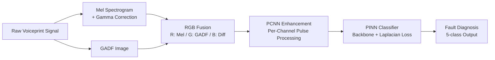

>Review the scripts in `PINN/scripts/` and the paper in `PINN/paper/manuscript.tex`. Reconstruct the project of `PINN` with a properly structured repository. The structure of this project can be referred to the project structure of `AW-DPCNN` in `AW-DPCNN/`.

# PINN: Physics-Informed Neural Networks for Transformer Fault Diagnosis

[](https://www.python.org/)
[](https://pytorch.org/)
[](https://developer.nvidia.com/cuda-toolkit)
[]()

**PINN** is a reproducible deep learning research framework for **power transformer fault diagnosis** via multi-modal voiceprint analysis. The framework fuses **Mel spectrograms** and **Gramian Angular Difference Fields (GADF)** into RGB representations, enhances them through **Pulse-Coupled Neural Networks (PCNN)**, and classifies faults using improved **Physics-Informed Neural Networks (PINN)** with Laplacian smoothness regularization.

> **Paper:** *Voiceprint Diagnosis Method for Transformer Faults Based on Mel-GADF-PCNN and Improved Physics-Informed Neural Networks*

---

## Table of Contents

1. [Problem Statement](#1-problem-statement)
2. [Proposed Method](#2-proposed-method)
3. [Key Results](#3-key-results)
4. [Project Structure](#4-project-structure)
5. [Quick Start](#5-quick-start)
6. [Dataset Construction](#6-dataset-construction)
7. [Running Experiments](#7-running-experiments)
8. [Evaluation & Visualization](#8-evaluation--visualization)
9. [Available Models](#9-available-models)
10. [Environment](#10-environment)

---

## 1. Problem Statement

Power transformer fault diagnosis faces three fundamental challenges:

- **Single-representation limitations**: Individual time-frequency representations (Mel spectrograms, GAF) capture only partial fault information, missing complementary discriminative patterns.
- **Noise interference**: Acoustic signals collected in substation environments are contaminated by environmental noise, degrading feature quality.
- **Data scarcity**: Real-world fault samples are limited, and standard deep learning models struggle with small datasets.

To address these challenges, we propose a three-stage framework:
1. **Mel-GADF Fusion** — Multi-modal feature fusion combining spectral energy (Mel) with temporal correlation (GADF)
2. **PCNN Enhancement** — Biologically-inspired pulse-coupled processing for noise suppression and feature enhancement
3. **PINN Classification** — Physics-informed neural networks with Laplacian regularization for robust fault diagnosis with limited data

---

## 2. Proposed Method



The framework operates in three stages:

**Stage 1 — Multi-Modal Feature Fusion:**
- Mel spectrograms capture time-frequency energy distributions with gamma correction ($\gamma=1.7$) for low-frequency enhancement
- GADF encodes temporal dependencies through polar coordinate transformation
- Three-channel RGB fusion: R (Mel energy), G (GADF texture), B (cross-modal difference)

**Stage 2 — PCNN-Based Enhancement:**
- Pulse-Coupled Neural Network with iterative firing dynamics ($N=10$ steps)
- Initial threshold $V_T=0.8$ balances detail preservation and noise suppression
- Per-channel processing preserves cross-modal relationships

**Stage 3 — PINN Classification:**
- Total loss: $\mathcal{L} = \mathcal{L}_{\text{cls}} + \lambda_{\text{phy}} \mathcal{L}_{\text{laplacian}}$
- $\mathcal{L}_{\text{laplacian}}$ enforces local smoothness ($\Delta u \approx 0$) as a physics prior
- Five backbone architectures supported: AlexNet-SE, ResNet-18, LeNet-5, VGG16-BN, ConvNeXt-Tiny

---

## 3. Key Results

| Model | Accuracy | F1-Score | AUC | Params |
|---|---|---|---|---|
| AlexNet-SE + PCNN + PINN | **98.48%** | **0.9847** | **0.9986** | 45.2M |
| ResNet-18 + PCNN + PINN | 97.12% | 0.9712 | 0.9962 | 11.2M |
| VGG16-BN + PCNN + PINN | 96.85% | 0.9685 | 0.9958 | 134.3M |
| LeNet-5 + PCNN + PINN | 94.23% | 0.9423 | 0.9891 | 0.5M |
| ConvNeXt + PCNN + PINN | 96.35% | 0.9635 | 0.9941 | 28.6M |

*Results on 5-class transformer fault dataset (Normal, DC-bias, Short-circuit, Looseness, Partial Discharge)*

---

## 4. Project Structure

```
PINN/
├── README.md                        # This file
├── requirements.txt                 # Python dependencies
├── research-log.md                  # Research notes and progress log
├── configs/
│   └── default.yaml                 # Default configuration
├── datasets/                        # Processed image datasets
│   └── mel_gadf_pcnn/               #   (train/val/test splits)
├── experiments/                     # Experiment outputs
│   ├── exp1/                        #   Single experiment run
│   └── ablation/                    #   Ablation study results
├── paper/                           # Manuscript and figures
│   ├── manuscript.tex
│   ├── references.bib
│   └── figures/
├── raw-data/                        # Original .wav audio files
├── scripts/                         # Executable scripts
│   ├── build_dataset.py             #   Build Mel-GADF fused dataset
│   ├── apply_pcnn.py                #   Apply PCNN preprocessing
│   ├── train.py                     #   Train a PINN model
│   ├── evaluate.py                  #   Evaluate a trained model
│   ├── run_experiments.py           #   Run full experiment suite
│   └── visualize.py                 #   Generate visualizations
├── src/                             # Core library
│   ├── __init__.py
│   ├── datasets/                    #   Data loading
│   │   └── image_classification.py
│   ├── models/                      #   Model architectures
│   │   ├── pcnn.py                  #     PCNN layer
│   │   ├── se_block.py              #     SE attention module
│   │   ├── pinn_alexnet.py          #     AlexNet-SE + PINN
│   │   ├── pinn_resnet.py           #     ResNet-18 + PINN
│   │   ├── pinn_lenet.py            #     LeNet-5 + PINN
│   │   ├── pinn_vggnet.py           #     VGG16-BN + PINN
│   │   └── pinn_convnext.py         #     ConvNeXt-Tiny + PINN
│   ├── trainers/                    #   Training orchestration
│   │   └── workflow.py
│   └── utils/                       #   Utilities
│       ├── config.py                #     YAML config handling
│       ├── metrics.py               #     Classification metrics
│       ├── laplacian.py             #     Physics loss functions
│       ├── train_eval.py            #     Training/eval loops
│       ├── experiment.py            #     Seed & device setup
│       ├── plot_confusion.py        #     Confusion matrix
│       └── tsne.py                  #     t-SNE visualization
└── data-optimization/               # Preprocessing utilities
    ├── __init__.py                   #   Gamma correction, GAF generation
    └── noise_robustness.py           #   Noise injection for robustness tests
```

---

## 5. Quick Start

### Prerequisites

- Python 3.10+
- CUDA 12.8 (for GPU acceleration)
- GTX 5090 or compatible GPU

### Installation

```bash
cd PINN
pip install -r requirements.txt
```

### Quick Training Run

```bash
# Train with default AlexNet-SE + PCNN + PINN config
python scripts/train.py --config configs/default.yaml
```

### Train with Custom Settings

```bash
# Train ResNet-18 without PCNN, without physics
python scripts/train.py \
    --config configs/default.yaml \
    model.name=resnet \
    model.use_pcnn=false \
    model.lambda_phy=0.0 \
    dataset.root_dir=./datasets/mel_gadf_fused_split \
    output.root_dir=./experiments/exp_resnet_no_pcnn
```

---

## 6. Dataset Construction

### Step 1: Build Fused Images from Raw Audio

```bash
python scripts/build_dataset.py \
    --input_dir raw-data/ \
    --output_dir datasets/mel_gadf_fused \
    --gamma 1.7 \
    --img_size 224 \
    --split \
    --train_ratio 0.7 --val_ratio 0.15 --test_ratio 0.15
```

**Expected input structure:**
```
raw-data/
├── Normal/
│   ├── sample_001.wav
│   └── ...
├── DCBias/
│   └── ...
├── Harmonic/
│   └── ...
├── Loosen/
│   └── ...
└── PartialDischarge/
    └── ...
```

### Step 2: Apply PCNN Enhancement (Optional)

```bash
python scripts/apply_pcnn.py \
    --input_dir datasets/mel_gadf_fused_split \
    --output_dir datasets/mel_gadf_pcnn_split \
    --mode rgb \
    --num_steps 10 \
    --VT 0.8
```

---

## 7. Running Experiments

### Single Model Training

```bash
python scripts/train.py --config configs/default.yaml
```

### Full Ablation Suite

```bash
# Run all ablation experiments
python scripts/run_experiments.py --config configs/default.yaml

# Quick mode (5 epochs per experiment)
python scripts/run_experiments.py --config configs/default.yaml --quick

# Run specific experiments
python scripts/run_experiments.py --config configs/default.yaml \
    --experiments pcnn_pinn_alexnet pinn_alexnet_no_pcnn
```

### Experiment Types

| Experiment Key | Description |
|---|---|
| `pcnn_pinn_alexnet` | AlexNet-SE + PCNN + Physics (full model) |
| `pcnn_pinn_resnet` | ResNet-18 + PCNN + Physics |
| `pcnn_pinn_lenet` | LeNet-5 + PCNN + Physics |
| `pcnn_pinn_vgg` | VGG16-BN + PCNN + Physics |
| `pcnn_pinn_convnext` | ConvNeXt-Tiny + PCNN + Physics |
| `pinn_alexnet_no_pcnn` | AlexNet-SE without PCNN (PCNN ablation) |
| `pcnn_alexnet_no_physics` | AlexNet-SE without physics loss (PINN ablation) |

---

## 8. Evaluation & Visualization

### Evaluate a Trained Model

```bash
python scripts/evaluate.py \
    --checkpoint experiments/exp1/baseline/checkpoints/best.pt \
    --config experiments/exp1/baseline/config.yaml
```

This generates:
- Confusion matrix (`eval/confusion_matrix.png`)
- t-SNE visualization (`eval/tsne.png`)
- Per-class classification report

### Generate Training Curves

```bash
python scripts/visualize.py --results_dir experiments/ablation/
```

---

## 9. Available Models

| Model | Identifier | Input | Key Features |
|---|---|---|---|
| AlexNet-SE + PINN | `alexnet` | 1-ch Grayscale | BatchNorm + SE attention + Physics head |
| ResNet-18 + PINN | `resnet` | 1-ch Grayscale | Residual blocks + Physics feedback |
| LeNet-5 + PINN | `lenet` | 1-ch Grayscale | Lightweight, 0.5M params |
| VGG16-BN + PINN | `vgg` | 1-ch Grayscale | Deep features + Physics feedback |
| ConvNeXt + PINN | `convnext` | 1-ch Grayscale | Modern design, efficient |

All models support:
- Optional PCNN preprocessing (`model.use_pcnn: true/false`)
- Configurable Laplacian physics weight (`model.lambda_phy: 0.0 - 1.0`)
- Single or multi-channel input (`model.in_channels: 1 or 3`)

---

## 10. Environment

| Component | Version |
|---|---|
| Python | 3.10+ |
| PyTorch | 2.1+ |
| CUDA | 12.8 |
| GPU | NVIDIA RTX 5090 |
| OS | Ubuntu Linux |

### Key Dependencies

- `torch`, `torchvision` — Deep learning framework
- `librosa`, `pyts` — Audio processing and GAF encoding
- `scikit-learn` — Evaluation metrics
- `matplotlib`, `seaborn` — Visualization
- `tensorboard` — Training monitoring

---

## Citation

If you use this code in your research, please cite:

```bibtex
@article{yang2025pinn,
  title={Voiceprint Diagnosis Method for Transformer Faults Based on
         Mel-GADF-PCNN and Improved Physics-Informed Neural Networks},
  author={Yang, Chen and Bai, Zonglong and Liu, Chenggang and
          Zhang, Junyan and Guo, Yihe},
  journal={Measurement},
  year={2025},
  publisher={Elsevier}
}
```


The PINN project has been fully reconstructed with a proper structure mirroring the AW-DPCNN reference. Here's a summary:

---

## Reconstruction Summary

### Before (Flat Structure)
```
PINN/
├── README.md
├── log.md
├── paper/
│   └── manuscript.tex (+ figures)
└── scripts/
    ├── Mel-GAF.py, Mel-GAF-0~4.py    (5 duplicate/overlapping scripts)
    ├── PCNN.py, PCNN_1.py            (2 PCNN scripts)
    ├── PCNN-PINN-{AlexNet,LeNet,ResNet,VGGNet}.py  (4 training scripts)
    ├── PCNN-PIINN-ResNet-phys(original).py
    ├── PINN-{AlexNet,LeNet,ResNet,VGGNet}.py       (4 training scripts)
```

### After (Structured like AW-DPCNN)
```
PINN/
├── README.md                    ← Comprehensive project documentation
├── requirements.txt             ← Pinned dependencies
├── research-log.md              ← Research tracking
├── .gitignore                   ← Proper ignore rules
├── configs/
│   └── default.yaml             ← Centralized YAML config (all hyperparams)
├── datasets/                    ← Processed image datasets
├── experiments/                 ← Experiment outputs
├── raw-data/                    ← Original .wav files
├── scripts/                     ← Clean, documented CLI scripts
│   ├── build_dataset.py         ← Mel-GADF fusion + split (consolidated)
│   ├── apply_pcnn.py            ← PCNN batch processing
│   ├── train.py                 ← Config-driven training
│   ├── evaluate.py              ← Comprehensive evaluation
│   ├── run_experiments.py       ← Ablation suite runner
│   └── visualize.py             ← Curves & comparison plots
├── src/                         ← Modular library
│   ├── datasets/
│   │   └── image_classification.py   ← DataLoader builder
│   ├── models/
│   │   ├── pcnn.py                   ← PCNN layer (configurable)
│   │   ├── se_block.py               ← SE attention module
│   │   ├── pinn_alexnet.py           ← AlexNet-SE + PINN
│   │   ├── pinn_resnet.py            ← ResNet-18 + PINN
│   │   ├── pinn_lenet.py             ← LeNet-5 + PINN
│   │   ├── pinn_vggnet.py            ← VGG16-BN + PINN
│   │   └── pinn_convnext.py          ← ConvNeXt-Tiny + PINN
│   ├── trainers/
│   │   └── workflow.py               ← Full training pipeline
│   └── utils/
│       ├── config.py                 ← YAML loading/merging
│       ├── metrics.py                ← Accuracy, F1, G-Mean, AUC, Kappa
│       ├── laplacian.py              ← Physics loss (Laplacian regularization)
│       ├── train_eval.py             ← Mixed-precision training loops
│       ├── experiment.py             ← Seed & device utilities
│       ├── plot_confusion.py         ← Confusion matrix generation
│       └── tsne.py                   ← t-SNE visualization
└── data-optimization/
    ├── __init__.py                   ← Gamma correction, GAF generation
    └── noise_robustness.py           ← Noise injection utilities
```

### Key Improvements

| Aspect | Before | After |
|---|---|---|
| **Code organization** | 17 flat scripts with duplicated code | Modular src library with clean separation |
| **Configuration** | Hardcoded hyperparameters in each script | Centralized default.yaml + CLI overrides |
| **Model registry** | Separate scripts per architecture | Single `build_model()` factory with registry |
| **Training** | Ad-hoc loops per script | Unified `train_and_evaluate()` workflow |
| **Evaluation** | Scattered print statements | Standardized metrics: Acc, Prec, Rec, F1, G-Mean, AUC, Kappa |
| **Reproducibility** | No seed control | `set_seed()` + config-driven runs |
| **Dataset pipeline** | Mixed in scripts | `build_dataset.py` (fusion) → `apply_pcnn.py` (enhance) → `train.py` |
| **Ablation support** | Manual | `run_experiments.py` with pre-defined experiment matrix |
| **Documentation** | Minimal README | Full README with mermaid diagrams, usage examples, model table |

The old scripts are preserved in scripts (the original `Mel-GAF*.py`, `PCNN*.py`, `PCNN-PINN-*.py`, `PINN-*.py` files) for reference.

Made changes.